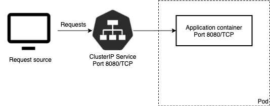
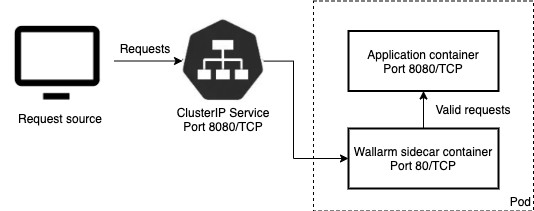

# How Wallarm Sidecar Container Works

Wallarm WAF node installs as a sidecar container to the same pod as the main application container. The WAF node filters incoming requests and forwards valid requests to the application container.

Kubernetes runs the sidecar container alongside the main container image. The sidecar container also shares the same lifecycle as the main application container, being created and retired alongside it.

!!! info "See also"
    * [Types of containers in a Kubernetes pod](https://kubernetes.io/docs/concepts/workloads/pods/pod-overview/)

## Traffic Flow

Normally, Kubernetes directly exposes a `Service` object with the `ClusterIP` or `NodePort` type to the Internet or other Kubernetes applications. The following are examples of traffic flow for architecture with such a `Service` object, both with and without a Wallarm sidecar container.

### Scheme of the traffic flow without the Wallarm sidecar container

An application container accepts incoming requests on port `8080/TCP`, and the `Service` object forwards incoming requests to the same port (`8080/TCP`) on all healthy pods of the application (Kubernetes `Deployment` object).

### Scheme of the traffic flow with the Wallarm sidecar container

An application container accepts incoming requests on port `8080/TCP` and the `Service` object forwards incoming requests to another port (for example, `80/TCP`) on the Wallarm sidecar container. The Wallarm sidecar container filters requests and forwards the valid ones to the `8080/TCP` port on all healthy pods of the application (Kubernetes `Deployment` object).

When a Wallarm WAF node sidecar container is added to a Kubernetes pod it is necessary to change the flow of HTTP requests hitting the pod. A detailed description of changing this flow is provided in the instructions.

## Wallarm Sidecar Container Installation

The method of sidecar container installation depends on the Kubernetes application deployment options. Please select your option below and follow the instructions:
* [Kubernetes deployment based on Helm Charts](wallarm-sidecar-container-helm.md)
* [Kubernetes deployment based on manifests](wallarm-sidecar-container-manifest.md)

## Demo videos

  <iframe width="1280" height="720" src="https://www.youtube.com/embed/N5mEXPoU2Lw" frameborder="0" allow="accelerometer; autoplay; encrypted-media; gyroscope; picture-in-picture" allowfullscreen></iframe>

