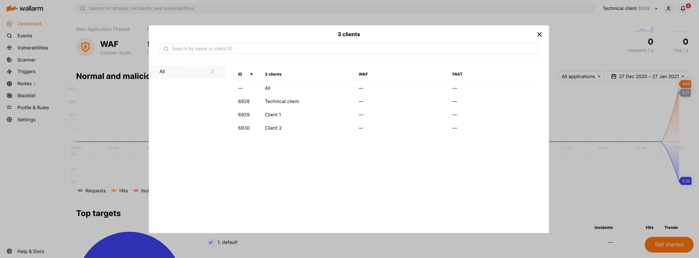

# Creating and linking clients

## Requirements

* Access to the [technical client account](creating-partner-account.md) with the **Global administrator** user role and disabled two‑factor authentication in the Wallarm Console
* [Partner UUID](creating-partner-account.md#step-2-access-the-partner-account-and-get-parameters-for-the-waf-node-configuration)

## Procedure for creating and linking clients

Clients are created and linked to the partner account via the Wallarm API. Authenticated requests to Wallarm API can be sent from the own client or from the API Reference UI. The method of request authentication depends on the client sending the request:

* For requests sent from the **API Reference UI**, it is required to sign in to the Wallarm Console with the **Global administrator** user role and update the API Reference by the link:
    * https://apiconsole.eu1.wallarm.com/ for the EU Cloud
    * https://apiconsole.us1.wallarm.com/ for the US Cloud
* For requests sent from the **own client**, it is required to pass in the request the [user UUID and secret key](../api/overview.md#your-own-client)

### Step 1: Create the client via the Wallarm API

At this step, a partner client account will be created and linked to the partner account.

1. Send the POST request to the route `/v1/objects/client/create` with the following parameters:

    Parameter | Description | Request part | Required
    --------- | -------- | ------------- | ---------
    `name` | Client name. | Body | Yes
    `vuln_prefix` | Vulnerability prefix that Wallarm will use for vulnerability tracking and association with the client. The prefix must contain four capital letters or numbers and be related to a client name. For example: `CLNT` for the client `Client`. | Body | Yes
    `partner_uuid` | [Partner UUID](creating-partner-account.md#step-2-access-the-partner-account-and-get-parameters-for-the-waf-node-configuration). | Body | Yes
    `language` | Language for the client account in the Wallarm Console interface: `en` or `ru`. By default, the language specififed when switching the account to the partner status is used. | Body | No
    `X‑WallarmAPI‑UUID` | [User UUID](../api/overview.md#your-own-client). | Header | Yes, when sending a request from own client
    `X‑WallarmAPI‑Secret` | [Secret key](../api/overview.md#your-own-client). | Header | Yes, when sending a request from own client

    ??? info "Show an example of the request sent from own client"
        === "EU Cloud"
            ``` bash
            curl -v -X POST "https://api.wallarm.com/v1/objects/client/create" -H "X-WallarmAPI-UUID: YOUR_UUID" -H "X-WallarmAPI-Secret: YOUR_SECRET_KEY" -H "accept: application/json" -H "Content-Type: application/json" -d "{ \"name\": \"Client\", \"vuln_prefix\": \"CLNT\", \"partner_uuid\": \"YOUR_PARTNER_UUID\"}"
            ```
        === "US Cloud"
            ```bash
            curl -v -X POST "https://us1.api.wallarm.com/v1/objects/client/create" -H "X-WallarmAPI-UUID: YOUR_UUID" -H "X-WallarmAPI-Secret: YOUR_SECRET_KEY" -H "accept: application/json" -H "Content-Type: application/json" -d "{ \"name\": \"Client\", \"vuln_prefix\": \"CLNT\", \"partner_uuid\": \"YOUR_PARTNER_UUID\"}"
            ```

2. Copy the values of the `id` and `partnerid` parameters from the response to the request. The parameters will be used when linking a client to a partner account.

Created clients will be visually presented in the Wallarm Console for the [global partner users](../user-guides/settings/users.md#user-roles). For example, `Client 1` and `Client 2`:



### Step 2: Link the client to a partner account via the Wallarm API

At this step, ID will be set for a partner-client application link. One client might have several applications and several IDs, respectively. This ID will be used in NGINX configuration (`wallarm_instance`) for splitting the traffic by client applications.

1. Send the POST request to the route `/v2/partner/<partnerid>/partner_client` with the following parameters:

    Parameter | Description | Request part | Required
    --------- | -------- | ------------- | ------
    `partnerid` | The `partnerid` value obtained after the client was created. | Path | Yes
    `clientid` | Client ID obtained after client creation (`id`).  | Body | Yes
    `id` | ID for the partner-client link. Can be an arbitrary positive integer. | Body | Yes
    `X‑WallarmAPI‑UUID` | [User UUID](../api/overview.md#your-own-client). | Header | Yes, when sending a request from own client
    `X‑WallarmAPI‑Secret` | [Secret key](../api/overview.md#your-own-client). | Header | Yes, when sending a request from own client

    ??? info "Show an example of the request sent from own client"
        === "EU Cloud"
            ``` bash
            curl -v -X POST "https://api.wallarm.com/v2/partner/111/partner_client" -H "X-WallarmAPI-UUID: YOUR_UUID" -H "X-WallarmAPI-Secret: YOUR_SECRET_KEY" -H "accept: application/json" -H "Content-Type: application/json" -d "{ \"clientid\": 888, \"id\": \"13\"}"
            ```
        === "US Cloud"
            ```bash
            curl -v -X POST "https://us1.api.wallarm.com/v2/partner/111/partner_client" -H "X-WallarmAPI-UUID: YOUR_UUID" -H "X-WallarmAPI-Secret: YOUR_SECRET_KEY" -H "accept: application/json" -H "Content-Type: application/json" -d "{ \"clientid\": 888, \"id\": \"14\"}"
            ```

2. Copy and save the `id` value you passed in the request. This ID will be used in NGINX configuration (`wallarm_instance`) for splitting several clients traffic.

If you configure the WAF node for several applications of the client, send the API request for each application passing different `id` value.

When the client resource gets the traffic, the configured `id` will be displayed in the Wallarm Console → **Settings** → **Applications** for an appropriate partner client account.

## Providing clients with access to the Wallarm Console

You can provide your clients with access to their accounts in the Wallarm Console. Clients will be able to track blocked requests, analyze discovered vulnerabilities, and perform additional configuration of the WAF node via the Wallarm Console.

To provide a client with access to an account, go to the appropriate partner client account via the client selector → section **Settings** → **Users** and add users with the required roles. Only regular roles can be set for users of the partner client account. Reqular roles give access to only one partner client account.

[Open the roles description →](../user-guides/settings/users.md)
