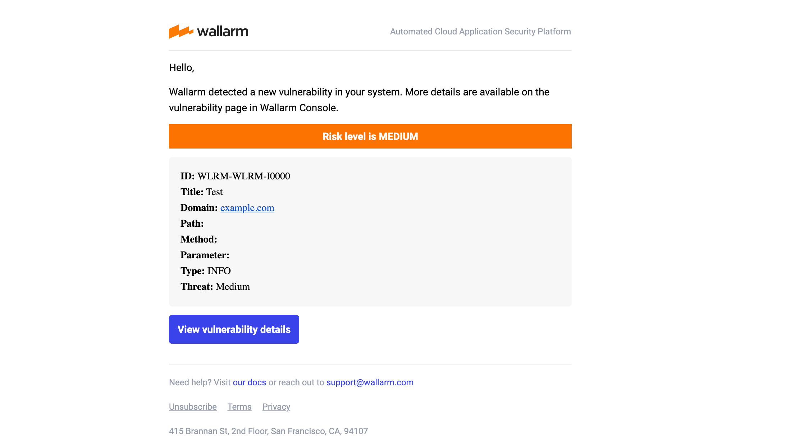

# Email Report

You can set additional email addresses that will be used to deliver scheduled reports and instant notifications. Sending messages to your primary email is configured by default.

* Scheduled reports can be sent on a daily, weekly, or monthly basis. Reports include detailed information about vulnerabilities, attacks, and incidents detected in your system over the selected period.
* Notifications include brief details of triggered events:
    --8<-- "../include/integrations/events-for-integrations.md"

## Setting up integration

1. Open **Settings** → **Integrations** tab.
2. Click the **Email report** block or click the **Add integration** button and choose **Email report**. 
3. Enter an integration name.
4. Enter email addresses using a comma as a separator.
5. Choose the frequency of sending security reports. If the frequency is not chosen, then reports will not be sent.
6. Choose event types to trigger notifications. If the events are not chosen, then notifications will not be sent.
7. [Test the integration](#testing-integration) and ensure the settings are correct.
8. Click **Add integration**.

    

## Testing integration

--8<-- "../include/integrations/test-integration.md"

Test notification example:

## Updating integration

--8<-- "../include/integrations/update-integration.md"

## Disabling integration

--8<-- "../include/integrations/disable-integration.md"

## Deleting integration

--8<-- "../include/integrations/remove-integration.md"
